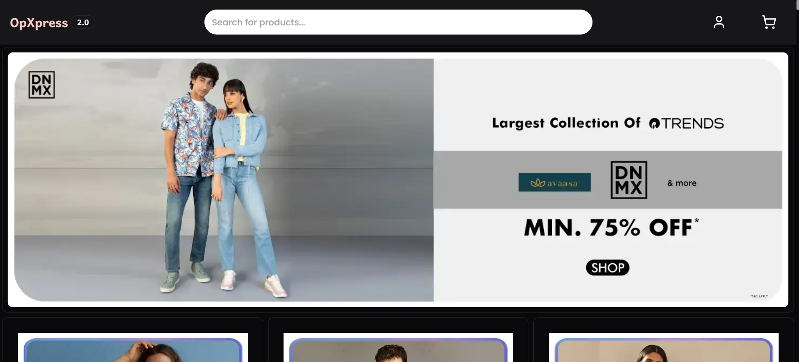

# OpXpress 2.0 - Your Ultimate Destination for Quick and Easy Shopping

<p align="center">
  <a href="https://opxpress2.sushant.fun">
    <picture>
      
    </picture>
    <h1 align="center">OpXpress 2.0</h1>
  </a>
</p>

## Links:

- **Front-end:** https://opxpress2.sushant.fun
- **Back-end:** https://api.opxpress2.sushant.fun

## About the App:

Discover a world of convenience with OpXpress 2.0! Shop for the latest trends, hottest deals, and must-have items all in one place. With our user-friendly interface and lightning-fast service, shopping has never been easier. Join the OpXpress community today and experience hassle-free shopping like never before!

## Technologies Used:

- **TypeScript:** A strongly typed programming language that builds on JavaScript, giving you better tooling at any scale.

- **Express.js:** A Node.js library for creating server side applications.

- **Prisma ORM:** An open-source database toolkit that simplifies database access with an auto-generated and type-safe query builder, enabling seamless integration with TypeScript.

- **MongoDB:** A NoSQL database that provides flexible and scalable storage for various types of data, ensuring efficient data management for the application.

- **Next.js:** A React.js framework for building fast, modern websites and web applications.

- **Redux Toolkit:** A library for managing application state, making it easier to write efficient and scalable code.

- **Tailwind CSS:** A utility-first CSS framework for quickly building custom user interfaces.

- **Shadcn:** A UI library to build responsive user interfaces.

## Features:

- **Authentication:**
  Secure and seamless user authentication using JWT, ensuring user data privacy and security.

- **Cart Management:**
  Efficient cart management system allowing users to add, remove, and update products in their cart effortlessly.

- **Products Showcase:**
  Attractive and organized display of a wide range of products with detailed descriptions and images.

- **Products Search:**
  A powerful search feature allowing users to quickly find products by name or keywords, making the shopping process faster and more user-friendly.

- **Category-wise Filtering:**
  Advanced filtering options to help users easily find products based on categories, enhancing the shopping experience.

- **Order Storage in Database:**
  Robust order management system that stores individual user orders in the MongoDB database for easy retrieval and tracking.

- **Responsive UI:**
  A highly responsive user interface built with Shadcn, Tailwind CSS, and other modern UI frameworks, ensuring a smooth shopping experience across all devices.

## Screenshots:

### Home Page

<div align="center">
  
</div>

<div align="center">
  
</div>

<div align="center">
  
</div>

### Product Page

<div align="center">
  
</div>

### Cart Page

<div align="center">
  
</div>

### Checkout

<div align="center">
  
</div>

### Orders Page

<div align="center">
  
</div>

### Search Results Page

<div align="center">
  
</div>

### Login

<div align="center">
  
</div>

### Signup

<div align="center">
  
</div>

## How to Run:

### **Clone the Repository:**

First, clone the repository to your local machine:

```bash
git clone https://github.com/mskp/OpXpress-2.0
cd OpXpress-2.0
```

### **Install the Dependencies:**

Ensure you have `bun` installed on your system. You can install `bun` by following the instructions on the [Bun website](https://bun.sh/).

```bash
# Install the dependencies for the client
cd client && bun i

# Install the dependencies for the server
cd ../server && bun i
```

### **Run the Development Server:**

To run the development server for both the client and the server, use the following commands:

```bash
# Run the client development server
cd client
bun dev

# In a new terminal, run the server development server
cd server
bun start:dev
```

### **Set Up Environment Variables:**

There are `.env.example` files in both the `client` and `server` directories that contain sample variables required to run this project. You need to create a `.env` file in each directory and set these variables with appropriate values.

1. **Client:**

- Navigate to the `client` directory.
- Copy the `.env.example` file to a new file named `.env`.
- Open the `.env` file and set the variables with the proper values.

  ```bash
  cd client
  cp .env.example .env
  # Edit the .env file to set the correct values
  ```

2. **Server:**

- Navigate to the `server` directory.
- Copy the `.env.example` file to a new file named `.env`.
- Open the `.env` file and set the variables with the proper values.

  ```bash
  cd server
  cp .env.example .env
  # Edit the .env file to set the correct values
  ```

> By following these steps, you'll be able to run the OpXpress-2.0 project locally with both the front-end and back-end servers running in development mode.

### Deployment

#### Deploying Next.js Front-end

1. **Fork the Repository:**

- Go to [OpXpress-2.0 GitHub repository](https://github.com/mskp/OpXpress-2.0).
- Click on the "Fork" button in the top-right corner to fork the repository to your GitHub account.

2. **Create a Vercel Account:**

- If you don't already have a Vercel account, sign up at [Vercel](https://vercel.com/signup).

3. **Log in to Vercel:**

- Log in to your Vercel account.

4. **Create a New Project:**

- Click on "New Project" in the Vercel dashboard.

5. **Import Git Repository:**

- Select "Import Git Repository."
- Connect your GitHub account if prompted.

6. **Select Forked Repository:**

- Choose the forked repository (OpXpress-2.0) from your GitHub account.

7. **Configure Project Settings:**

- Select the `client` directory of the project.
- Add any necessary environment variables for your Next.js application.

8. **Deploy:**

- Click on "Deploy" and wait for the deployment process to complete.

#### Deploying Express.js API

1. **Fork the Repository:**

- Ensure you have already forked the repository [OpXpress-2.0 GitHub repository](https://github.com/mskp/OpXpress-2.0).

2. **Create a Vercel Account:**

- If you don't already have a Vercel account, sign up at [Vercel](https://vercel.com/signup).

3. **Log in to Vercel:**

- Log in to your Vercel account.

4. **Create a New Project:**

- Click on "New Project" in the Vercel dashboard.

5. **Import Git Repository:**

- Select "Import Git Repository."
- Connect your GitHub account if prompted.

6. **Select Forked Repository:**

- Choose the forked repository (OpXpress-2.0) from your GitHub account.

7. **Configure Project Settings:**

- Select the `server` directory of the project.
- Add any necessary environment variables for your Express.js application.

8. **Deploy:**

- Click on "Deploy" and wait for the deployment process to complete.

> By following these steps, you'll have successfully deployed both the Next.js front-end and the Express.js API for your OpXpress-2.0 project on Vercel.

#### Access the Deployed Application:

- Once deployed, the application will be accessible via the provided deployment URL.

### Developer Info:

- **Sushant Pandey**

- GitHub: [https://github.com/mskp](https://github.com/mskp)
- Email: sushhantpandey@gmail.com
- LinkedIn: [https://linkedin.com/in/mskp](https://linkedin.com/in/mskp)
- All Links: [https://linktr.ee/isushant](https://linktr.ee/isushant)
